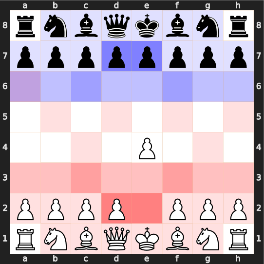
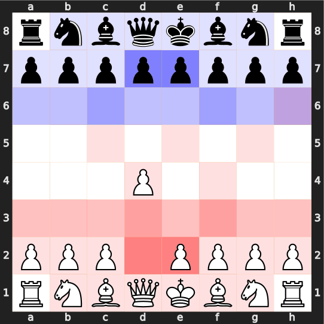
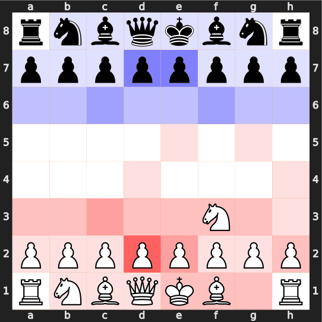
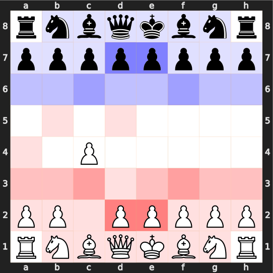

# chess_lens

This is a simple tool to render chess games as animated GIFs, coloring the squares
according to how many attacks each side has on that square. The idea is to use this
tool to visualize the "control" of the board by each side in a game.

The idea for this came from Reddit user [/u/ShootBoomZap](https://www.reddit.com/user/ShootBoomZap)
who posted an image on the [/r/chessbeginners](https://www.reddit.com/r/chessbeginners) subreddit
([original post](https://www.reddit.com/r/chessbeginners/comments/1gldlpk/started_creating_these_chess_heatmaps_to/)).

The tool is written in Python and uses the [python-chess](https://python-chess.readthedocs.io/en/latest/)
library to parse the games and calculate the attacks. The rendering is done using
svglib, reportlab, and pygifsicle. The tool is still very basic and has a lot of
room for improvement.

## Examples

Below are some examples of games rendered with this tool; the games were selected by ChatGPT
and were selected to illustrate how chess strategy has evolved over time.

- Adolf Anderssen vs. Lionel Kieseritzky, "Immortal Game" (1851)

  In this iconic game, Anderssen aggressively controls the center with pawns
  and pieces, following a classical style that emphasizes occupation. This game
  exemplifies early central control principles and romantic play, with rapid
  attacks and sacrifices to dominate the center and attack the king.

  

- Jose Raul Capablanca vs. Emanuel Lasker, World Championship Match (1921)

  In this game, Capablanca (a classical player) controls the center in a
  balanced and structural way, not overextending but gradually building his
  position. Capablanca's approach shows a shift toward positional play and
  careful pawn control of the center rather than overly aggressive occupation.

  

- Richard Réti vs. José Raúl Capablanca, New York (1924)

  This game is a great example of the hypermodern approach, pioneered by
  players like Réti, Nimzowitsch, and Tartakower. Here, Réti allows Capablanca
  to occupy the center with pawns but exerts pressure from a distance using
  pieces to undermine that control. The game demonstrates the hypermodern idea
  that controlling the center can sometimes be achieved indirectly.

  

- Mikhail Botvinnik vs. Paul Keres, USSR Championship (1941)

  Botvinnik’s play shows a blend of classical and hypermodern ideas, where
  central control is often fluid and dynamic rather than rigid. Botvinnik
  occupies the center when it’s safe and relinquishes it when he can attack on
  the flanks. This adaptability is a hallmark of more modern play.

  

- Bobby Fischer vs. Boris Spassky, Game 6, World Championship (1972)

  Fischer's play illustrates a deep understanding of central control, combining
  both occupation and flexibility. In this game, Fischer’s famous use of the
  Poisoned Pawn Variation in the Sicilian Defense leads to indirect center
  control, with dynamic tactics and well-timed central pawn moves.

  

- Garry Kasparov vs. Anatoly Karpov, World Championship (1985)

  Kasparov’s games against Karpov often featured a deep understanding of center
  dynamics, where Kasparov would focus on activity and coordination rather than
  strict occupation. Kasparov's flexible use of the center often enabled him to
  transition smoothly into strong attacks on Karpov’s position.

  

## Improvements

There are improvements that could be done to the visualization. One thing that
it doesn't capture is X-rays, where a piece attacks another piece through an
intermediate piece. This is a common tactic in chess and could be interesting
to visualize.

Another improvement is to increase the intensity of the color based on the
value of the piece attacking (the more valuable a piece, the less intense
the color since the attack is more costly). For example, a pawn attacking a
square could be an intense color, while a queen attacking a square could be a
fainter color.

One big technical improvement would be that this could be converted to a
javascript tool that could run in a browser and allow the user to interact with
the visualization, seeing the attacks for each move, etc., rather than just a
static GIF rendered using python. This would allow for more dynamic and
interactive visualizations. Maybe I could find a nice browser-based PGN
viewer and add this visualization to it.
